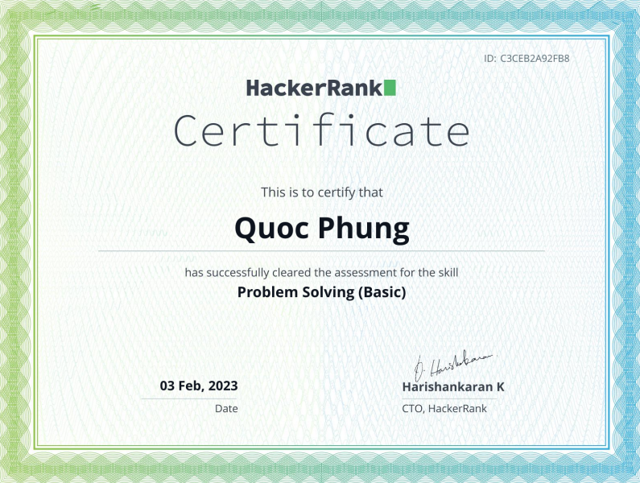
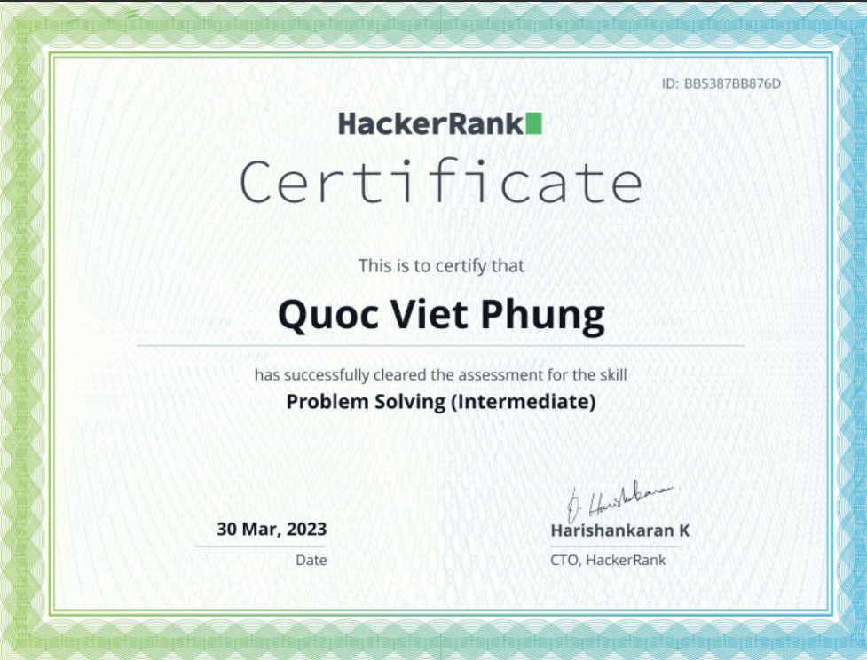
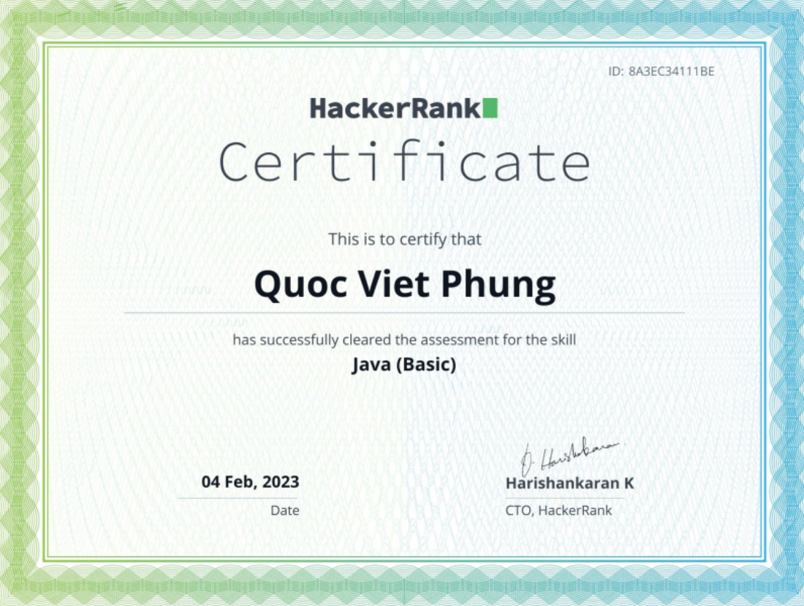
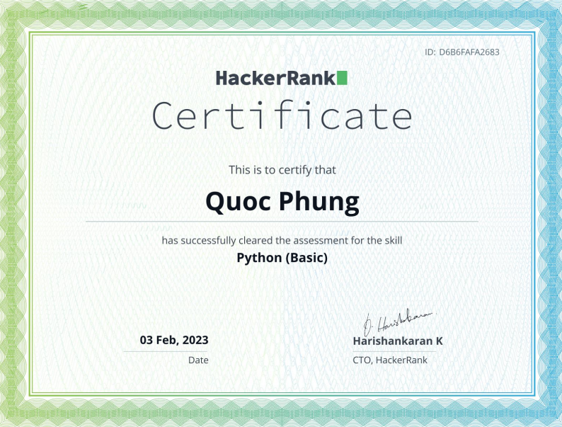

<h1 align="center">Hi, I'm Viet Phung</h1>

<strong>AI Consultant | Fullstack Engineer | Cloud & Data Enthusiast</strong>

<table>
  <tr>
    <td width="68%" valign="top">
      

        I'm a software engineer with 4+ years of experience building products at the intersection of
        AI, cloud computing, and fullstack development. With a Computer Science background from the
        University of Applied Sciences Muenster in Germany, I like turning ideas into clear, practical,
        and maintainable systems.
      

      

        I value continuous learning, thoughtful experimentation, and close collaboration. Outside of tech,
        I enjoy travel, photography, and simple product experiences that feel polished from the first interaction.
      

      <ul>
        <li>Based in Wuppertal, Germany</li>
        <li>Focus on AI products, cloud platforms, and data-driven applications</li>
        <li>Open to consulting, collaboration, and product engineering work</li>
      </ul>
    </td>
    <td width="32%" align="center">
      
    </td>
  </tr>
</table>

### GitHub Stats

  
  

### Current focus
- AI-assisted workflows and automation
- Scalable fullstack application development
- Clean user interfaces with strong UX and maintainability
- Cloud and data solutions that are easy to operate

### Tech stack

  
  
  
  
  
  
  

### Certifications
<table>
  <tr>
    <td align="center">
      
       
      Problem Solving (Basic)
    </td>
    <td align="center">
      
       
      Problem Solving (Intermediate)
    </td>
  </tr>
  <tr>
    <td align="center">
      
       
      Java (Basic)
    </td>
    <td align="center">
      
       
      Python (Basic)
    </td>
  </tr>
</table>

### Featured project
- [my-ai-portfolio](https://my-ai-portfolio-seven.vercel.app) - Personal portfolio site with a clean presentation of my background, skills, and contact details.

### Connect with me
- Email: [quocvietphung1993@gmail.com](mailto:quocvietphung1993@gmail.com)
- LinkedIn: [viet-phung-00b740168](https://www.linkedin.com/in/viet-phung-00b740168/)
- Portfolio: [my-ai-portfolio-seven.vercel.app](https://my-ai-portfolio-seven.vercel.app)
- GitHub: [quocvietphung](https://github.com/quocvietphung)

Built with simple HTML, CSS, and a focus on clarity.

