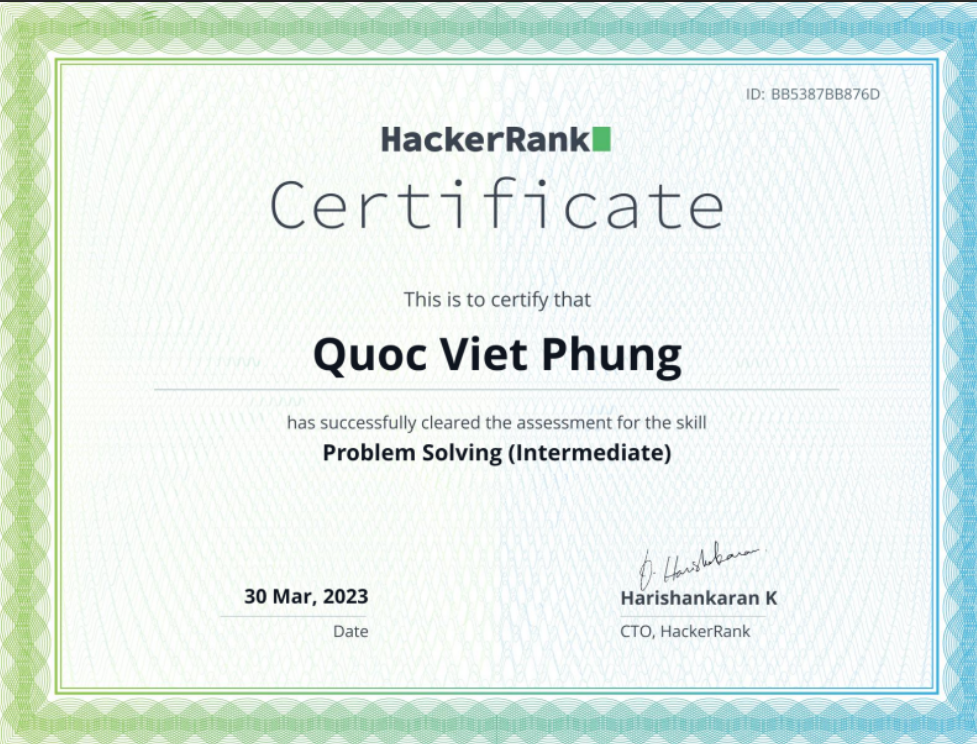

### Hi there 👋

<!--
**quocvietphung/quocvietphung** is a ✨ _special_ ✨ repository because its `README.md` (this file) appears on your GitHub profile.
-->

I'm Quoc Viet Phung, a software developer with over 2 years of experience in OOP programming. Throughout my career, I have honed my skills in building efficient and scalable software solutions. I understand the importance of writing clean and readable code, adhering to coding standards, and collaborating effectively with team members to achieve project goals.

My passion for coding goes beyond just developing software. I am deeply interested in the exciting fields of data science and artificial intelligence. I strongly believe that automation can help people save valuable time on manual calculations and increase accuracy in their work. My education includes a degree in Computer Science from the University of Applied Sciences Münster, and I continuously strive to expand my knowledge and skills in the ever-evolving technology field and software solutions. I enjoy building applications that solve real-world problems and bring value to people's lives.

Aside from coding, I have a range of interests, including art, literature, sports, and travel. I aspire to capture breathtaking photographs from every stunning corner of the world. 🌍🌅🌁

- 🌱 I’m currently learning machine learning and its coordination with software engineering

- 💬 Ask me about software development, machine learning, and data science

- 📫 How to reach me: https://www.linkedin.com/in/quoc-viet-phung-00b740168/

### Techstack:

- #### Backend:
    - Python 
    - Java 
    - PHP 
    - Ruby on Rails 

- #### Frontend:
    - HTML 
    - CSS 
    - Javascript 
    - ReactJS 

- #### Devops:
    - Docker 
    - CI/CD AWS 

<h3 align="center"> Certifications of HackerRank</h3>

  
  
  
  

